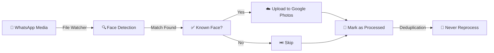

<p align="center">
  
</p>

<h1 align="center">DMAF</h1>
<h3 align="center">🧠 Don't Miss A Face</h3>

<p align="center">
  <strong>Automated WhatsApp media backup with intelligent face recognition filtering</strong>
</p>

<p align="center">
  Never miss a photo of your loved ones again! Without the clutter from backup of your entire WhatsApp media — <br/>
  DMAF watches your WhatsApp media, recognizes faces of people you care, and backs it up to Google Photos.
</p>

<p align="center">
  <a href="https://github.com/yhyatt/DMAF/actions/workflows/ci.yml">
    
  </a>
  <a href="https://github.com/yhyatt/DMAF/blob/main/LICENSE">
    
  </a>
  <a href="https://github.com/yhyatt/DMAF">
    
  </a>
</p>

<p align="center">
  <a href="https://github.com/yhyatt/DMAF/stargazers">
    
  </a>
  <a href="https://github.com/yhyatt/DMAF/issues">
    
  </a>
  <a href="https://github.com/yhyatt/DMAF/commits/main">
    
  </a>
  <a href="https://github.com/yhyatt/DMAF">
    
  </a>
</p>

<p align="center">
  <a href="#-features">Features</a> •
  <a href="#-quick-start">Quick Start</a> •
  <a href="#-how-it-works">How It Works</a> •
  <a href="#%EF%B8%8F-configuration">Configuration</a> •
  <a href="#-face-recognition-backends">Backends</a> •
  <a href="#-contributing">Contributing</a>
</p>

---

## ✨ Features

<table>
<tr>
<td width="50%">

### 🔍 Smart Face Recognition
- **Three powerful backends**: `dlib` (CPU-optimized), `InsightFace` (non-commercial), or `AuraFace` (Apache 2.0, **commercial use OK**)
- **Extensible architecture**: Plugin-based backend system for adding new recognition engines
- **Multi-face detection**: Handles group photos with multiple faces
- **Video clip support**: Scans WhatsApp video clips for known faces — stops on first match and uploads the full clip to Google Photos
- **Configurable tolerance**: Fine-tune matching sensitivity
- **Advanced detection thresholds**: Separate thresholds for training vs. production matching

</td>
<td width="50%">

### ☁️ Google Photos Integration
- **Automatic uploads**: Seamlessly backup to Google Photos
- **Album organization**: Optionally organize into specific albums
- **OAuth2 authentication**: Secure, token-based access
- **Cloud staging support**: Delete source files after upload (ideal for Dropbox/GCS staging)

</td>
</tr>
<tr>
<td width="50%">

### ⚡ Efficient Processing
- **SHA256 deduplication**: Never process the same image twice
- **Intelligent retry logic**: Exponential backoff for network resilience
- **Thread-safe database**: Handle concurrent operations safely

</td>
<td width="50%">

### 🔧 Developer Friendly
- **Modern Python 3.10+**: Type hints, Pydantic validation
- **Flexible configuration**: YAML config with environment variable support
- **Modular architecture**: Easy to extend and customize

</td>
</tr>
<tr>
<td width="50%">

### 📧 Observability & Monitoring
- **Email alerts**: SMTP notifications for errors and borderline recognitions
- **Score tracking**: Records similarity scores (0.0-1.0) for all matches
- **Batched notifications**: Hourly alerts prevent email spam
- **Event retention**: 90-day retention with automatic cleanup

</td>
<td width="50%">

### 🔄 Auto-Refresh Training
- **Intelligent updates**: Automatically adds training images every 60 days
- **Smart selection**: Chooses moderately challenging images (score ≈ 0.65)
- **Face cropping**: Extracts and saves cropped faces with padding
- **Email notifications**: Get notified when new training images are added

</td>
</tr>
</table>

---

## 🚀 Quick Start

### Prerequisites

- Python 3.10 or higher
- Google Cloud project with Photos Library API enabled
- WhatsApp media access via:
  - **[OpenClaw](https://openclaw.ai) integration** (iPhone/Android) - ⭐ Recommended (zero-maintenance, auto-collects group media)
  - **WhatsApp Desktop + rclone** (iOS/Android) - Cross-platform, zero duplicates
  - Android direct sync (FolderSync Pro, Syncthing) - Best for Android-only
  - See [DEPLOYMENT.md](DEPLOYMENT.md#whatsapp-media-sync-setup) for detailed setup guides

### Installation

```bash
# Clone the repository
git clone https://github.com/yhyatt/DMAF.git
cd DMAF

# Create virtual environment
python -m venv .venv
source .venv/bin/activate  # On Windows: .venv\Scripts\activate

# Install with your preferred face recognition backend
pip install -e ".[auraface]"  # ⭐ Recommended: Commercial use OK (Apache 2.0)
# OR
pip install -e ".[insightface]"  # High accuracy, non-commercial license only
# OR
pip install -e ".[face-recognition]"  # CPU-optimized, easier setup
# OR
pip install -e ".[all]"  # All backends
```

### Setup

1. **Configure Google Photos API**
   ```bash
   # Download client_secret.json from Google Cloud Console
   # Place it in the project root directory
   ```

2. **Add reference photos of people to recognize**

   **For local development:**
   ```
   data/known_people/
   ├── Alice/
   │   ├── photo1.jpg
   │   └── photo2.jpg
   └── Bob/
       └── photo1.jpg
   ```

   **For cloud deployment:** Upload reference photos to a GCS bucket instead:
   ```bash
   gsutil -m rsync -r -x ".*Zone\.Identifier$" data/known_people/ gs://your-bucket/
   ```
   Then set `known_people_gcs_uri: "gs://your-bucket"` in your cloud config.

3. **Create your configuration**
   ```bash
   cp config.example.yaml config.yaml
   # Edit config.yaml with your WhatsApp media paths
   ```

4. **Run DMAF**
   ```bash
   dmaf --config config.yaml
   # Or: python -m dmaf --config config.yaml
   ```

5. **Optional: Enable Email Alerts** (Recommended)
   - Get notified about borderline recognitions and errors
   - See [**DEPLOYMENT.md**](DEPLOYMENT.md#email-alerts-setup-optional-but-recommended) for detailed setup

📖 **For complete setup instructions, troubleshooting, and advanced configuration, see [DEPLOYMENT.md](DEPLOYMENT.md)**

---

## 🔄 How It Works



1. **Watch** - DMAF monitors your configured WhatsApp media directories for new images and video clips
2. **Load Known Faces** - Reference photos loaded from local directory or downloaded from GCS bucket (cloud deployment)
3. **Detect** - Each new image or video clip is analyzed for faces using your chosen backend. Videos are sampled at 1fps (2fps for clips under 10s) and scanning stops as soon as a known face is found
4. **Recognize** - Detected faces are compared against your known people database
5. **Upload** - Matched images and full video clips are uploaded to Google Photos
6. **Deduplicate** - SHA256 hashing ensures no file is ever processed twice

---

## ⚙️ Configuration

DMAF uses a YAML configuration file with full Pydantic validation:

```yaml
# Watch directories - your WhatsApp media locations
watch_dirs:
  - "/path/to/WhatsApp/Media/WhatsApp Images"

# Google Photos album (optional)
google_photos_album_name: "Family - Auto WhatsApp"

# Face recognition settings
recognition:
  backend: "auraface"          # "auraface" (recommended), "insightface", or "face_recognition"
  tolerance: 0.5               # Lower = stricter matching (0.0-1.0)
  det_thresh: 0.4               # Detection threshold for test images
  det_thresh_known: 0.3         # More permissive for training images
  min_face_size_pixels: 80      # Ignore tiny faces
  require_any_match: true       # Only upload if known face found
  return_best_only: true        # Use highest confidence face per image

# Known people directory (local development)
known_people_dir: "./data/known_people"

# Known people GCS bucket (cloud deployment — overrides known_people_dir)
# known_people_gcs_uri: "gs://your-bucket"

# Deduplication database
dedup:
  method: "sha256"
  db_path: "./data/state.sqlite3"
```

See [`config.example.yaml`](config.example.yaml) for a complete example with all options.

---

## 🧠 Face Recognition Backends

DMAF uses a **plugin-based architecture** that makes it easy to add new face recognition engines. Currently includes three production-ready backends:

| Feature | AuraFace ⭐ Recommended | InsightFace | face_recognition (dlib) |
|---------|-------------|-------------|-------------------------|
| **License** | ✅ **Apache 2.0** (commercial OK) | ⚠️ Non-commercial only | MIT |
| **Accuracy (TPR)** | 80-85% | 82.5% | 92.5% |
| **False Positive Rate** | ✅ **0.0%** 🛡️ | 1.87% | ~11% ⚠️ |
| **Speed** | ⚡ Fast (12x vs dlib) | ⚡ **Fastest** | 🐢 Slow |
| **GPU Support** | ✅ Yes (CUDA) | ✅ Yes (CUDA) | ❌ CPU only |
| **Privacy** | **Perfect** - Zero false positives | Good - Rare false positives | Risky - False matches |
| **Installation** | Requires ONNX Runtime | Requires ONNX Runtime | Requires dlib + cmake |
| **Best For** | 🏆 **Commercial production apps** | Research/academic projects | Testing, development |

### 🏆 Recommendation

**Use AuraFace** for commercial production deployments. Benchmark testing with 40 family photos + 123 strangers showed:
- ✅ **Zero false positives** - Perfect privacy (0.0% FPR vs InsightFace's 1.87%)
- ✅ **Apache 2.0 license** - Fully commercial, no restrictions
- ✅ **85% detection rate** - Excellent coverage with tolerance=0.5
- ✅ **Same infrastructure as InsightFace** - 12x faster than dlib
- ✅ **Production-ready** - Conservative settings prevent privacy violations

**Use InsightFace** if you need academic/research use only and want slightly higher accuracy (non-commercial license).

**Use face_recognition** for quick testing or development only (high false positive rate makes it unsuitable for production).

### 🔌 Extensible Architecture

Adding a new backend is simple - implement the interface:
```python
# src/dmaf/face_recognition/your_backend.py
def load_known_faces(known_root: str, **params):
    """Load and encode faces from known_people directory."""
    ...

def best_match(known_faces, test_image, **params):
    """Match test image against known faces."""
    ...
```

Register in `factory.py` and you're done! See existing backends for examples.

---

## 📁 Project Structure

```
dmaf/
├── src/dmaf/
│   ├── __main__.py           # CLI entry point
│   ├── config.py             # Pydantic settings
│   ├── database.py           # Thread-safe SQLite
│   ├── watcher.py            # File monitoring
│   ├── face_recognition/     # Detection backends
│   │   ├── factory.py        # Backend selection
│   │   ├── dlib_backend.py   # face_recognition
│   │   ├── insightface_backend.py
│   │   └── auraface_backend.py  # AuraFace (Apache 2.0)
│   ├── google_photos/        # Google Photos API
│   └── utils/                # Retry logic, helpers
├── data/
│   ├── known_people/         # Your reference images
│   └── state.sqlite3         # Deduplication DB
├── config.yaml               # Your configuration
└── pyproject.toml            # Package definition
```

---

## 🛠️ Development

```bash
# Install dev dependencies
pip install -e ".[dev,all]"

# Run tests
pytest tests/ -v --cov=dmaf

# Type checking
mypy src/dmaf

# Linting
ruff check src/
black --check src/
```

---

## 🗺️ Roadmap

- [x] **Phase A**: Core bug fixes (RGB/BGR, caching, retry logic) ✅
- [x] **Phase B**: Project restructuring (src layout, Pydantic) ✅
- [x] **Phase C**: Unit tests (75% coverage, 286 tests) ✅
- [x] **Phase D**: Face recognition benchmarking & LOOCV validation ✅
- [x] **Phase D+**: Advanced detection tuning & FPR analysis ✅
- [x] **Phase E**: CI/CD (GitHub Actions, automated testing) ✅
- [x] **Phase F-prep**: Observability & auto-refresh (alerts, score tracking, AuraFace backend) ✅ **NEW**
- [x] **Phase F**: Cloud deployment (GCS + Cloud Run + Firestore) ✅
- [ ] **Phase G**: Documentation & open-source 🚧

**Current Progress:** ~90% complete (8 of 9 phases done)

---

## 🤝 Contributing

Contributions are welcome! Please feel free to submit a Pull Request.

1. Fork the repository
2. Create your feature branch (`git checkout -b feature/amazing-feature`)
3. Commit your changes (`git commit -m 'Add amazing feature'`)
4. Push to the branch (`git push origin feature/amazing-feature`)
5. Open a Pull Request

---

## 📄 License

This project is licensed under the MIT License - see the [LICENSE](LICENSE) file for details.

---

## 🙏 Acknowledgments

- [AuraFace](https://huggingface.co/fal/AuraFace-v1) - Apache 2.0 licensed face recognition model
- [InsightFace](https://github.com/deepinsight/insightface) - Deep learning face analysis
- [face_recognition](https://github.com/ageitgey/face_recognition) - dlib-based face recognition
- [Google Photos Library API](https://developers.google.com/photos/library/guides/get-started)
- [Watchdog](https://github.com/gorakhargosh/watchdog) - File system monitoring

---

<p align="center">
  <sub>Made with ❤️ by <a href="https://github.com/yhyatt">yhyatt</a></sub>
</p>

<p align="center">
  <a href="https://github.com/yhyatt/DMAF">
    
  </a>
</p>
