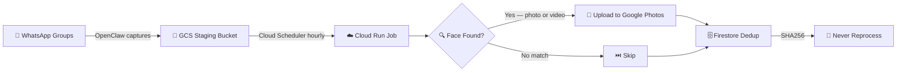

<p align="center">
  
</p>

<h1 align="center">🦞 DMAF</h1>
<h3 align="center">Don't Miss A Face</h3>

<p align="center">
  <strong>Automated WhatsApp photo & video backup with intelligent face recognition</strong>
</p>

<p align="center">
  Never miss a moment with your loved ones — DMAF watches your WhatsApp groups,<br/>
  recognizes the faces you care about in photos <em>and videos</em>, and backs them up to Google Photos automatically.<br/>
  <strong>Set it up once. After that: zero LLM tokens, minimal cloud costs, fully autonomous.</strong>
</p>

<p align="center">
  <a href="https://github.com/yhyatt/DMAF/actions/workflows/ci.yml">
    
  </a>
  <a href="https://github.com/yhyatt/DMAF/blob/main/LICENSE">
    
  </a>
  <a href="https://github.com/yhyatt/DMAF">
    
  </a>
</p>

<p align="center">
  <a href="https://github.com/yhyatt/DMAF/stargazers">
    
  </a>
  <a href="https://github.com/yhyatt/DMAF/issues">
    
  </a>
  <a href="https://github.com/yhyatt/DMAF/commits/main">
    
  </a>
</p>

<p align="center">
  <a href="#-openclaw-friendly">OpenClaw 🦞</a> •
  <a href="#-features">Features</a> •
  <a href="#-quick-start">Quick Start</a> •
  <a href="#-how-it-works">How It Works</a> •
  <a href="#%EF%B8%8F-configuration">Configuration</a> •
  <a href="#-face-recognition-backends">Backends</a> •
  <a href="#-contributing">Contributing</a>
</p>

---

## 🦞 OpenClaw Friendly

DMAF is designed to be set up and operated entirely by an AI agent. If you use [OpenClaw](https://openclaw.ai), you can go from zero to a working pipeline with a single prompt.

**Install the DMAF skill** from [ClaWHub](https://clawhub.com/skills/dmaf) (or copy [`deploy/openclaw-skill/`](deploy/openclaw-skill/) to your skills directory), then just say:

> *"Set up DMAF for me. My GCP project ID is `[your-project]` and my WhatsApp is already connected to OpenClaw."*

Your agent will walk through the full setup: GCP project, service account, GCS buckets, reference photos, config, the media sync cron, and the Cloud Scheduler — reading [`deploy/setup-secrets.md`](deploy/setup-secrets.md) as its guide.

> 💡 **After setup: zero LLM tokens.** The ongoing pipeline is a system cron + Cloud Run job — pure infrastructure, no AI calls, no ongoing API cost.

**Also friendly for:**
- 🤖 **Coding agents** (Claude Code, Copilot, Cursor) — [`AGENTS.md`](AGENTS.md) gives full architecture context, test patterns, and common pitfalls
- 🦾 **MCP clients** (Claude Desktop, Claude Code, Cursor, Windsurf) — install the [MCP server](deploy/mcp-setup.md) and your AI can `trigger_scan()`, `get_status()`, `add_person()` and more — no gcloud knowledge needed

---

## ✨ Features

<table>
<tr>
<td width="50%">

### 🔍 Smart Face Recognition
- **Three powerful backends**: `dlib` (CPU-optimized), `InsightFace` (non-commercial), or `AuraFace` (Apache 2.0, **commercial use OK**)
- **Photos & video clips**: Scans both images and WhatsApp video clips — stops on first match, uploads the full clip
- **Multi-face detection**: Handles group photos and videos with multiple faces
- **Configurable tolerance**: Fine-tune matching sensitivity per deployment
- **Advanced detection thresholds**: Separate thresholds for training vs. production

</td>
<td width="50%">

### 🦞 OpenClaw Friendly
- **One-prompt setup**: Install the DMAF skill, describe your setup, done
- **WhatsApp media capture**: OpenClaw intercepts group photos & videos automatically — no desktop app, no Android required
- **Token-free after setup**: The sync cron and Cloud Run pipeline run with zero LLM calls — only minimal GCP infrastructure costs (Cloud Run + GCS, free-tier eligible)
- **Zero-maintenance sync**: System cron uploads media to GCS every 30 min, no agent involvement
- **Agent-operable**: Trigger scans, view logs, add people — all via shell/gcloud commands any agent can run
- 🤖 **Developer friendly**: `AGENTS.md` with architecture, mocks, pitfalls, CI rules
- 🦾 **Agentic friendly**: API-first pipeline, gcloud-scriptable end to end

</td>
</tr>
<tr>
<td width="50%">

### 🔄 Auto-Refresh Training
- **Intelligent updates**: Automatically adds high-quality matched frames to known_people every 60 days
- **Smart selection**: Picks moderately challenging images (score ≈ 0.65) for best training signal
- **Face cropping**: Extracts and saves padded face crops
- **Email notifications**: Get notified when training images are added

</td>
<td width="50%">

### ☁️ Google Photos Integration
- **Automatic uploads**: Photos and full video clips backed up seamlessly
- **Album organization**: Optionally organize into a named album
- **OAuth2 authentication**: Secure, offline token-based access
- **Cloud staging support**: Delete source files after upload (ideal for GCS pipelines)

</td>
</tr>
<tr>
<td width="50%">

### ⚡ Efficient & Token-Free
- **Zero LLM tokens after setup**: The entire pipeline — sync cron, face recognition, upload — runs without any AI calls
- **SHA256 deduplication**: Never process the same file twice — survives container restarts via Firestore
- **Video early exit**: Sampling stops the moment a known face is found — no wasted compute
- **Intelligent retry logic**: Exponential backoff for network resilience
- **Scale-to-zero**: Cloud Run Job — no cost when idle, GCP free tier eligible

</td>
<td width="50%">

### 📧 Observability & Monitoring
- **Email alerts**: SMTP notifications for errors and borderline recognitions
- **Score tracking**: Records similarity scores (0.0–1.0) for every match
- **Configurable timezone**: Alert emails show timestamps in your local time (IANA timezone)
- **Batched notifications**: Hourly digest prevents inbox spam
- **Event retention**: 90-day history with automatic cleanup

</td>
</tr>
</table>

---

## 🚀 Quick Start

### 🦞 Have OpenClaw? One prompt away

1. Install the DMAF skill from [ClaWHub](https://clawhub.com/skills/dmaf), or copy [`deploy/openclaw-skill/`](deploy/openclaw-skill/) to `~/.openclaw/skills/dmaf/`
2. Make sure your WhatsApp channel is linked in OpenClaw
3. Say to your agent:

```
Set up DMAF for me. My GCP project ID is [your-project-id] and my WhatsApp 
is already connected to OpenClaw. Walk me through everything.
```

Your agent reads [`deploy/setup-secrets.md`](deploy/setup-secrets.md) and [`deploy/openclaw-integration.md`](deploy/openclaw-integration.md) to guide you step by step.

> ✅ **Zero ongoing tokens.** Once setup is done, DMAF runs entirely on a system cron + Cloud Run — no LLM involved, no AI API costs — only the minimal GCP infrastructure you already pay for.

---

### 🛠️ Manual Setup

#### Prerequisites

- Python 3.10 or higher
- Google Cloud project with Photos Library API enabled
- WhatsApp media access via one of:
  - **[OpenClaw](https://openclaw.ai) integration** (iPhone/Android) — ⭐ Recommended, see [`deploy/openclaw-integration.md`](deploy/openclaw-integration.md)
  - **WhatsApp Desktop + rclone** — Cross-platform
  - **Android direct sync** — FolderSync Pro, Syncthing

#### Installation

```bash
git clone https://github.com/yhyatt/DMAF.git
cd DMAF

python -m venv .venv && source .venv/bin/activate

# Choose your face recognition backend:
pip install -e ".[auraface]"       # ⭐ Apache 2.0 — commercial OK, zero false positives
pip install -e ".[insightface]"    # High accuracy, non-commercial only
pip install -e ".[face-recognition]"  # CPU-optimized, easiest setup
```

#### Setup

1. **Add reference photos** of the people to recognize:
   ```
   data/known_people/
   ├── Alice/
   │   ├── photo1.jpg
   │   └── photo2.jpg
   └── Bob/
       └── photo1.jpg
   ```

2. **Configure:**
   ```bash
   cp config.example.yaml config.yaml
   # Edit config.yaml — set watch_dirs and recognition backend
   ```

3. **Run:**
   ```bash
   dmaf --config config.yaml
   # Or: python -m dmaf --config config.yaml
   ```

4. **Cloud deployment** (GCS + Cloud Run, runs on a schedule, scales to zero):
   → Follow [`deploy/setup-secrets.md`](deploy/setup-secrets.md)

---

## 🔄 How It Works



1. **Capture** — OpenClaw intercepts WhatsApp group media and saves it locally; a system cron (zero LLM tokens) uploads it to GCS every 30 min
2. **Schedule** — Cloud Scheduler triggers the Cloud Run job hourly — no agent, no AI cost
3. **Load** — Reference photos downloaded from GCS bucket at job startup
4. **Detect** — Each file is scanned: images once, videos sampled at 1–2fps with early exit on first match
5. **Upload** — Matched photos and full video clips are uploaded to Google Photos
6. **Deduplicate** — SHA256 hash stored in Firestore; the same file is never processed twice

---

## ⚙️ Configuration

```yaml
watch_dirs:
  - "gs://your-project-whatsapp-media/"   # GCS staging bucket (cloud)
  - "/path/to/WhatsApp/Images"            # Local directory (dev)

known_people_gcs_uri: "gs://your-project-known-people"

recognition:
  backend: "auraface"      # auraface | insightface | face_recognition
  tolerance: 0.5           # 0.0 (strictest) → 1.0 (loosest)
  min_face_size_pixels: 20

google_photos_album_name: "Family — Auto WhatsApp"

alerting:
  enabled: true
  timezone: "America/New_York"   # IANA name — used in alert email timestamps
  recipients: ["you@example.com"]
```

Full annotated template: [`config.example.yaml`](config.example.yaml) | Cloud template: [`config.cloud.example.yaml`](config.cloud.example.yaml)

---

## 🧠 Face Recognition Backends

| Feature | AuraFace ⭐ | InsightFace | face_recognition (dlib) |
|---------|------------|-------------|-------------------------|
| **License** | ✅ Apache 2.0 (commercial OK) | ⚠️ Non-commercial | MIT |
| **False Positive Rate** | ✅ **0.0%** 🛡️ | 1.87% | ~11% ⚠️ |
| **Accuracy (TPR)** | 80–85% | 82.5% | 92.5% |
| **Speed** | ⚡ Fast (12× vs dlib) | ⚡ Fastest | 🐢 Slow |
| **GPU Support** | ✅ CUDA | ✅ CUDA | ❌ CPU only |
| **Best For** | 🏆 Production | Research | Development |

**Use AuraFace** for production — zero false positives means zero privacy violations. Commercial license, no restrictions.

### 🔌 Extensible Architecture

Adding a new backend is simple:
```python
# src/dmaf/face_recognition/your_backend.py
def load_known_faces(known_root: str, **params): ...
def best_match(known_faces, test_image, **params): ...
```
Register in `factory.py` and you're done. See existing backends for examples.

---

## 📁 Project Structure

```
DMAF/
├── src/dmaf/
│   ├── __main__.py           # CLI entrypoint + Uploader (on_match / on_match_video)
│   ├── config.py             # Pydantic settings — all fields with defaults + docs
│   ├── watcher.py            # Core scan loop + file processing helpers
│   ├── video_processor.py    # iter_frames generator, find_face_in_video (early exit)
│   ├── gcs_watcher.py        # GCS helpers: list, download, cleanup
│   ├── database.py           # SQLite (local) + Firestore (cloud) dedup backends
│   ├── known_refresh.py      # Auto-refresh training images
│   ├── alerting/             # Email alert batching and templates
│   └── face_recognition/     # Backend factory: AuraFace, InsightFace, dlib
├── deploy/
│   ├── setup-secrets.md      # 🔑 All credentials setup, start here
│   ├── openclaw-integration.md  # 🦞 OpenClaw media sync guide
│   ├── openclaw-skill/       # 🦞 Installable OpenClaw skill (ClaWHub)
│   ├── mcp-setup.md          # 🔌 MCP server setup (Claude Desktop / Code / Cursor)
│   └── README.md             # GCP deployment walkthrough
├── tests/                    # pytest — mirrors src/dmaf structure
├── AGENTS.md                 # 🤖 Coding agent guide (Claude, Copilot, Cursor)
├── config.example.yaml       # Annotated config template (local dev)
└── config.cloud.example.yaml # Annotated config template (cloud deployment)
```

---

## 🛠️ Development

```bash
pip install -e ".[dev,all]"
pre-commit install          # ruff + mypy before every commit

pytest tests/ -v            # Run tests
mypy src/dmaf               # Type check
ruff check src/ tests/      # Lint
```

See [`AGENTS.md`](AGENTS.md) for architecture decisions, mock patterns, and CI rules.

---

## 🗺️ Roadmap

- [x] **Phase A**: Core bug fixes (RGB/BGR, caching, retry logic) ✅
- [x] **Phase B**: Project restructuring (src layout, Pydantic) ✅
- [x] **Phase C**: Unit tests (286 tests, 75%+ coverage) ✅
- [x] **Phase D**: Face recognition benchmarking & LOOCV validation ✅
- [x] **Phase D+**: Advanced detection tuning & FPR analysis ✅
- [x] **Phase E**: CI/CD (GitHub Actions, automated testing) ✅
- [x] **Phase F-prep**: Observability & auto-refresh (alerts, score tracking, AuraFace) ✅
- [x] **Phase F**: Cloud deployment (GCS + Cloud Run + Firestore) ✅
- [x] **Phase G**: Documentation, OpenClaw skill, open-source ready ✅

---

## 🤝 Contributing

1. Fork the repository
2. Create your feature branch (`git checkout -b feature/amazing-feature`)
3. Commit your changes (`git commit -m 'Add amazing feature'`)
4. Push to the branch (`git push origin feature/amazing-feature`)
5. Open a Pull Request

---

## 📄 License

MIT License — see [LICENSE](LICENSE) for details.

---

## 🙏 Acknowledgments

- [AuraFace](https://huggingface.co/fal/AuraFace-v1) — Apache 2.0 face recognition model
- [InsightFace](https://github.com/deepinsight/insightface) — Deep learning face analysis
- [face_recognition](https://github.com/ageitgey/face_recognition) — dlib-based recognition
- [OpenClaw](https://openclaw.ai) — AI agent platform with WhatsApp integration
- [Google Photos Library API](https://developers.google.com/photos/library/guides/get-started)
- [Watchdog](https://github.com/gorakhargosh/watchdog) — File system monitoring

---

<p align="center">
  <sub>Made with 🦀 by <a href="https://github.com/yhyatt">yhyatt</a></sub>
</p>

<p align="center">
  <a href="https://github.com/yhyatt/DMAF">
    
  </a>
</p>
